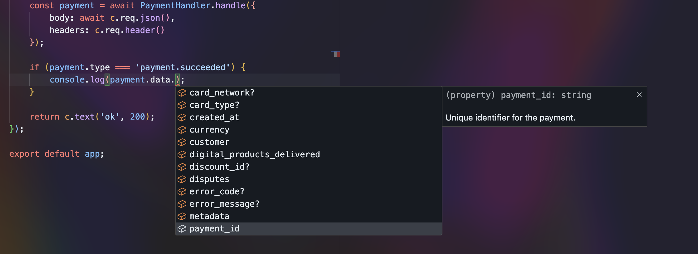

# Dodopayments Webooks

## Information
1. What is this?  
`dodopayments-webhooks` is a universal JavaScript library to handle webhook requests from [Dodopayments](https://dodopayments.com/).

2. What does this library do?  
It handles all the security part for you. It also provides type data & information on what each key does for all webhook methods provided by [Dodopayments](https://dodopayments.com/).

3. Why did I build it?  
I was building a project of mine using a certain backend library that [Dodopayments](https://dodopayments.com/) doesn't officially support. When time came to implement [Dodopayments](https://dodopayments.com/) webhooks, I faced a ton of issues. I had to hunt on a lot of documentation and ended up with some bad looking code, highly prone to error. This should not be the case when it comes to payments since it's a critical part of any business. Even though there are tons of JS frameworks and libraries popping up every month, [Dodopayments](https://dodopayments.com/) doesn't have a univeral way to implement their webhooks. They have limited support only for the most popular JS libraries available today. Hence, I felt the need to create a universal library to handle webhook requests for every backend library present, may it be well-known or lesser-known.

4. Is this affiliated with Dodopayments?  
No, this library is not affiliated with [Dodopayments](https://dodopayments.com/). It's a library I created to improve DX (Developer Experience) while building with [Dodopayments](https://dodopayments.com/).

5. How can you help?  
If you find a bug or have a suggestion, create a Github issue reporting it. If you're able to fix that bug, make a pull request.

6. What exactly is provided by this library?  
Webhook data verification, data types, autocomplete suggestions, descriptions, etc. are all provided by this library, even after being compatible with every proper backend framework out there.



<br/>
<br/>

## Installation, Implementation, Usage & Example

### Installation
```bash
npm install dodopayments-webhooks
```

or

```bash
bun add dodopayments-webhooks
```

<br/>

### Implementation
Step 1: Import the library into your JS/TS code.
```javascript
const { DodopaymentsHandler } = require('dodopayments-webhooks');
```

or

```javascript
import { DodopaymentsHandler } = from 'dodopayments-webhooks';
```

<br/>

Step 2: Create the `DodopaymentsHandler` object.
```javascript
const PaymentHandler = new DodopaymentsHandler({
    signing_key: "<Your Webhook Signing Key>"
});
```

Replace `<Your Webhook Signing Key>` with your Dodopayments webhooks secret. Check out the [Dodopayments docs](https://docs.dodopayments.com/developer-resources/webhooks) for more info.

<br/>

### Usage
Use your prefered JS/TS library/framework for the web server. Following is the global implementation of this library.

```javascript
PaymentHandler.handle({
    body: "<Request Body (Object or String)>",
    headers: "<Request Headers (Object)>",
});
```

<b>⚠️ Don't forget to respond some data with a 200 status code if the request was successfully completed. Otherwise, Dodopayments will send multiple requests to your webhook endpoint thinking something went wrong.</b>

<br/>

### Example
ExpressJS:  
‼️ When using with ExpressJS, remember to enable JSON for your POST requests. Without it, it will fail.
```javascript
const express = require('express');
const { DodopaymentsHandler } = require('dodopayments-webhooks');

const PaymentHandler = new DodopaymentsHandler({
    signing_key: "<Your Webhook Signing Key>"
});

const app = express();

// To enable JSON
app.use(express.json());

app.post('/your-webhook-url', async (req, res) => {
    try {
        const payment = await PaymentHandler.handle(req);
        // Some actions
        res.status(200).send('OK');
    } catch (e) {
        console.log(e.name);
        res.send('Error Occured!');
    }
});

app.listen(3000);
```

ElysiaJS:
```javascript
import { Elysia, t } from 'elysia';
import { DodopaymentsHandler } from 'dodopayments-webhooks';

const PaymentHandler = new DodopaymentsHandler({
    signing_key: "<Your Webhook Signing Key>"
});

const app = new Elysia();

app.post('/your-webhook-url', async ({ body, headers, set }) => {
    try {
        const payment = await PaymentHandler.handle({ body: body, headers: headers });
        // Some actions
        set.status = 200;
        return 'OK';
    } catch (e) {
        set.status = 500;
        console.log(e.name);
        return 'Error Occured!';
    }
}, {
    body: t.Object({}, { additionalProperties: true })
});

app.listen(3000);
```

HonoJS:
```javascript
import { Hono } from 'hono';
const app = new Hono();

const PaymentHandler = new DodopaymentsHandler({
    signing_key: "<Your Webhook Signing Key>"
});

app.post('/your-webhook-url', async (c) => {
    try{
        const payment = await PaymentHandler.handle({
            body: await c.req.json(),
            headers: c.req.header()
        });

        return c.text('ok', 200);
    } catch(e){
        console.log(e.name);
        return c.text('error', 500);
    }
});

export default app;
```

<br/>
<br/>

### Errors handling:
Note, the error keys for this library will be available in the "name" key inside the error object.  

Example:
```javascript
try{
    // Some Code Here
} catch(err){
    err.name // <- This
}
```

#### 1. dodopay_invalid_signature
This error name suggests that one of the following issues occured:  
1. The output has been tampered. It may be a malicious attacker trying to trick your system.

2. You are using an outdated/incorrect dodopayments webhooks signing key.

#### 2. dodopay_request_missing_data
This error name suggests one of the following:
1. Your request body is missing.
2. Your headers object is missing.
3. Your dodopayments signing key is not present.

#### 3. dodopay_webhook_missing_headers
This error name suggests that the key headers of the request are missing. Following are the important headers:  
1. "webhook-id"
2. "webhook-signature"
3. "webhook-timestamp"
<br/>
<br/>

<b>Hope this library helps you in your backend development!</b>
<br/>
Built with ❤️ by <a href="https://sancho1952007.github.io/">Sancho Godinho</a>&nbsp;👨‍💻
